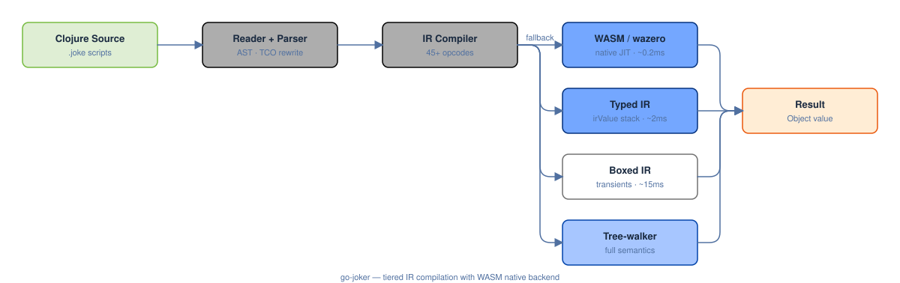

# go-joker


An optimized fork of [Joker](https://github.com/candid82/joker) (Clojure-like Lisp interpreter) for inclusion in [gi](https://github.com/rcarmo/gi), a self-hosted coding agent.

## Compatibility additions

This fork includes practical Babashka/let-go compatibility work beyond upstream Joker:

- `pods` and `babashka.pods` with bencode routing, subprocess lifecycle, dynamic vars, and JSON/EDN/Transit+JSON payloads.
- `joker.edn` plus `edn` alias namespace with `read-string`/`write-string` using the reader/printer without evaluation.
- Expanded `joker.transit` for pod-oriented Transit+JSON payloads.
- CLI entrypoint lives in `cmd/joker`; build with `go build -o joker ./cmd/joker`.
- Portable Babashka fixture suite via `make bb-compat`.
- Script-driven Babashka shim policy documented in `docs/BABASHKA_SHIM_ASSESSMENT.md`.
- Tracing/profile tooling documented in `docs/TRACING.md`; latest validated benchmark rerun in `docs/BENCHMARK_RESULTS_2026-05-16.md`, with profile audit context in `docs/BENCHMARK_PROFILE_2026-05-12.md`.

## Performance

### Performance — Joker vs Python vs Bun/JSC vs Goja vs let-go


### vs. original Joker


### Highlights

| What | Result |
|------|--------|
| **Mandelbrot** | **~0.095 ms** best-Joker path — ~68× faster than Python (~6.53 ms), ~4× faster than Bun/JSC, and ~123× faster than let-go |
| **N-body** | **~0.006 ms** best-Joker path — ~133× faster than Python, ~71× faster than Bun/JSC, and ~302× faster than let-go |
| **Fannkuch** | **~0.174 ms** best-Joker path — ~50× faster than Python, ~8× faster than Bun/JSC, and ~117× faster than let-go after output-equivalent audit |
| **Binary trees** | **~4.79 ms** best-Joker path — beats Python, Bun/JSC, Goja, and let-go in the current validated comparison |
| **Pidigits** | **~0.009 ms** — faster than Python, Bun/JSC, Goja, and let-go after JS BigInt correctness fix |
| **Arithmetic loop** | **~0.280 ms** — fastest in the validated comparison table |
| **Benchmark validation** | portable, micro, best-Joker/native helper, cross-runtime, and let-go-suite outputs are validated before timing reports/charts are accepted; latest full profile shows allocation/GC cost dominates portable CLBG paths |
| **Best-Joker suite** | wins **12/15** displayed workloads; beats Python on **15/15**, Goja on **15/15**, and let-go on **15/15** |
| **let-go suite** | current go-joker wins **3/7** mirrored let-go workloads (`reduce` ~14×, `loop-recur` ~9×, `persistent-map` slightly); let-go still leads recursive/sequence-heavy cases |
| **Language compliance** | **271/271 parity tests passing** + 7 imported jank-suite files passing |
| **Concurrency** | GIL-free — true parallel goroutines, futures, promises, agents, pmap |
| **Namespaces** | 29+ namespaces including `clojure.core.async`, `joker.random`, `joker.log`, HTTP router |

## What's different from upstream Joker

### Native integer codegen for recursive fns
Pure-integer recursive `defn` bodies (fib, tak) are compiled to fixed-arity native Go closures, eliminating all Object boxing and interface dispatch. fib(35) runs in 0.5s (53× faster than tree-walker).

### IR bytecode interpreter (typed + boxed paths)
Hot loops and functions compile to a flat bytecode. Eligible primitive/string loops now run on a typed IR value stack, while collection-heavy or unsupported cases fall back to the boxed IR interpreter and then to the tree-walker.

### WASM/wazero native compilation
Pure numeric loops compile further to WASM bytecode and execute via [wazero](https://github.com/tetratelabs/wazero)'s native code compiler. This achieves JIT-level performance (matching Bun/JSC) with zero CGo dependencies.

### Generic tail-call optimization
Self-recursive functions in tail position are automatically rewritten to `recur` at parse time, eliminating stack growth. A runtime trampoline handles cases the rewriter can't catch.

### Transient vectors and maps
Loops that update non-escaping vectors or maps via `assoc` automatically use in-place mutation (Clojure-style transients), eliminating persistent copy/update overhead while preserving persistent results at loop return.

### StringCursor native type
A zero-alloc O(1) string iterator with IR opcodes (`irCursorChar`, `irCursorNext`, `irCursorDone`). Cursor-based parsers run 3-3.5× faster than equivalent index-based code by eliminating per-character nth scanning and position arithmetic.

### IntRange + seq-walking reduce
`(range n)` with integer arguments returns an `IntRange` that implements reduce directly without seq allocation. Reduce-over-range is 18× faster. Lazy seqs (`LazySeq`, `ConsSeq`, `MappingSeq`) also support fast reduce.

### Full transducer semantics
`map`/`filter`/`take` transducer arities, `transduce` (3/4 arity), `reduced`/`reduced?`/`ensure-reduced`/`unreduced`, `completing`, `eduction`, and `sequence` 2-arity are implemented using a dedicated `Reduced` runtime type (not map-tag shims).

### Evaluator fast paths
Numeric operations, binding resolution, and function dispatch all have type-specialized fast paths that avoid the generic Joker evaluation machinery.

### Runtime introspection (`joker.runtime`)
Full IR/WASM/profiling introspection from Joker scripts: `disassemble`, `analyze`, `wasm-diagnostic`, `escape-analysis`, `profile`, `benchmark`, `mem-stats`, `gc`.

### GIL-free concurrency
The Global Interpreter Lock has been removed. Goroutines run in true parallel on Go scheduler threads. Immutable data structures need no coordination. Atoms use per-atom mutexes. Concurrency primitives: `alts!`, `timeout`, `future`, `promise`, `agent`, `pmap`, `pcalls`, plus a `clojure.core.async` compatibility namespace with `go-loop`, `put!`/`take!`, `pipe`, `merge`, `split`, `mult`, and `pub` helpers. Channel close is idempotent and safe under concurrent callers; sends after close return false and takes from closed channels yield `nil`.

### Additional namespaces / web runtime
- `joker.imaging` — image processing (resize, crop, blur, overlay) via pure Go, with guarded image/color argument boundaries
- `joker.svg` — SVG generation + raster rendering, with guarded coordinate-vector handling
- `joker.pdf` — PDF document generation, with checked document-proc arities
- `joker.random` — random numbers (int, float, choice, shuffle, uuid, secure-bytes)
- `joker.log` — leveled logging (debug, info, warn, error)
- `joker.http` — persistent keep-alive HTTP client, Ring-style HTTP server, **WebSocket** and **SSE/streaming** response extensions
- `joker.http.router` — Bottle-style HTTP routing with path params, middleware, CORS (`std/http/router/router.joke`)

### Clojure parity surface now implemented
- Protocols: public `defprotocol`, `extend-type`, `extend-protocol`, `satisfies?`, protocol method dispatch
- Records: public `defrecord`, generated `->Type`/`map->Type` constructors, `record?`, protocol clauses
- Hierarchies: `derive`, `underive`, `isa?`, `parents`, `ancestors`, `descendants`, `make-hierarchy`
- Tagged literals/readers: `#inst`, `#uuid`, `default-data-readers`, `*data-readers*`, `*default-data-reader-fn*`
- Sorted collection API: `sorted-map`, `sorted-set`, `sorted?`, `comparator`, `subseq`, `rsubseq`
- Atom mutation parity: `set-validator!`, `get-validator`, `add-watch`, `remove-watch`, `compare-and-set!`
- Chunked seq API: `chunk-buffer`, `chunk-append`, `chunk`, `chunk-cons`, `chunk-first`, `chunk-rest`, `chunk-next`, `chunked-seq?`
- Unchecked arithmetic + primitive array helpers: `unchecked-*`, `int-array`, `long-array`, `aget`, `aset`, `alength`, `aclone`, `make-array`

## Architecture



The repository layout is being split along architectural boundaries. The module identity is `github.com/rcarmo/go-joker`, the CLI lives in `cmd/joker`, tracing/IR/WASM/runtime leaf helpers are under `core/{trace,ir,wasm,runtime}`, data-only generated payloads and registries are under `core/generated`, and collection/reader construction is routed through guarded adapters before any package moves. The ongoing split plan is tracked in [`docs/refactor/README.md`](docs/refactor/README.md). Standard validation now includes generated-file/bootstrap, import-identity, non-goal, layout, refactor-internal, native-int, error-handling, core object/protocol, runtime execution, std native-boundary, docs, Babashka fixture, test, and vet guardrails.

- **WASM path**: pure integer/float loops → wazero JIT → native code (~0.2ms)
- **Typed IR path**: primitive/string/cursor loops → irValue stack, zero-boxing (~2–8ms)
- **Boxed IR path**: collections, fn calls, transients → []Object interpreter (~10–40ms)
- **Tree-walker**: full Clojure semantics (macros, special forms, I/O)
- **Fallback chain**: WASM → Typed IR → Boxed IR → Tree-walker (automatic)

## Building & testing

```bash
go test ./core              # run all tests
go test ./benchmarks/core -bench .     # run all benchmarks
make core-contract-check    # focused object/protocol split guardrails
make runtime-contract-check # focused runtime/execution-envelope guardrails
make std-contract-check     # focused std native-boundary guardrails
make parity                 # run language parity suite + refresh divergence matrix
make jank-subset            # run imported jank-lang/clojure-test-suite smoke subset
```

## Web notebooks

Joker includes a local EDN notebook runner/server for Mathematica-style exploratory documents with Observable-style manual dependency metadata:

```bash
joker notebook new example.edn --title Demo
joker notebook new example.edn --title Demo --serve --open -p 8080
joker notebook demo rich-demo.edn
joker notebook rich-demo.edn -p 8080 --open
joker notebook example.edn -p 8080       # local browser UI
joker notebook run example.edn           # headless execution, updates inline outputs
joker notebook validate example.edn      # format/cycle validation
joker notebook status example.edn        # status/size JSON
joker notebook deps example.edn          # dependency graph/cycles JSON
joker notebook snapshots example.edn     # list recovery snapshots
joker notebook export example.edn -o report.md
```

Notebook files are regular EDN maps with `:format :joker/notebook`; outputs are stored inline by default for self-contained agent/debug reports. See [`docs/NOTEBOOKS.md`](docs/NOTEBOOKS.md).

## Runtime documentation lookup

Joker includes a pydoc-style runtime documentation frontend backed by the live namespace metadata:

```bash
joker doc                         # list documented namespaces as Markdown
joker doc joker.string            # namespace documentation
joker doc joker.core/first        # qualified symbol documentation
joker doc search websocket        # full-text-ish namespace/var search
joker doc --format json first     # agent/tool-friendly JSON
joker doc serve -p 8080          # local browsable docs with search
joker doc serve --addr 127.0.0.1:8080
```

The CLI output is Markdown by default so agents and terminals can consume it directly. The local HTTP view uses the same runtime index and does not embed the generated static HTML/PNG documentation payload.

## Benchmarks

> **Note:** The CLBG programs were chosen as a starting point for optimizing the IR and WASM compilation pipeline, not because they represent realistic workloads. They stress specific interpreter bottlenecks (arithmetic loops, recursion, allocation, string processing) that guided the optimization work. Real-world gi scripts will have different profiles — the gains here prove the execution machinery works, not that every Joker program runs 500× faster.

```bash
# Full CLBG suite + micro benchmarks
go test ./core -run '^$' -bench 'BenchmarkCLBG|BenchmarkEval|BenchmarkWasm' -benchmem -benchtime=5x

# Cross-language comparison
python3 benchmarks/cross_lang_bench.py
bun benchmarks/cross_lang_bench.js

# Regenerate charts
go run ./tools/benchmarks/generate_svg.go ./benchmarks

# Check the same broad CI benchmark smoke ceilings used by GitHub Actions
go test ./benchmarks/core -bench 'BenchmarkCall|BenchmarkFib|BenchmarkTak|BenchmarkLoop|BenchmarkReduce|BenchmarkClosure|BenchmarkMap|BenchmarkVector|BenchmarkTransduce' -benchmem -benchtime=1s -count=3 > bench-results.txt
tests/benchmark_ci_check.sh bench-results.txt
```

## Documentation

- [`docs/BENCHMARK_CI.md`](docs/BENCHMARK_CI.md) — CI benchmark smoke guard policy and local reproduction
- [`docs/RUNTIME_DOCS.md`](docs/RUNTIME_DOCS.md) — `joker doc` Markdown/JSON lookup and local HTTP docs server
- [`docs/NOTEBOOKS.md`](docs/NOTEBOOKS.md) — EDN notebooks, headless runs, Markdown export, and local notebook server
- [`docs/refactor/README.md`](docs/refactor/README.md) — repository split plan and target folder structure
- [`docs/refactor/code-structure.md`](docs/refactor/code-structure.md) — package/module and coverage audit
- [`docs/refactor/module-structure-audit.md`](docs/refactor/module-structure-audit.md) — current Go module/package layout and next structural improvements
- [`docs/refactor/ir-boundary.md`](docs/refactor/ir-boundary.md) — IR package boundary inventory
- [`docs/refactor/ir-program-split.md`](docs/refactor/ir-program-split.md) — next-step IR model/envelope split design
- [`docs/refactor/generated-bootstrap-contract.md`](docs/refactor/generated-bootstrap-contract.md) — generated bootstrap data-only boundary design
- [`docs/refactor/runtime-execution-contract.md`](docs/refactor/runtime-execution-contract.md) — runtime/executor metadata split prerequisites
- [`docs/refactor/reader-construction-contract.md`](docs/refactor/reader-construction-contract.md) — reader construction/tagged literal split prerequisites
- [`docs/refactor/core-split.md`](docs/refactor/core-split.md) — collections/reader/runtime/WASM split candidates
- [`docs/refactor/object-protocol-contracts.md`](docs/refactor/object-protocol-contracts.md) — object/protocol contracts blocking broad core moves
- [`docs/refactor/generated-boundary.md`](docs/refactor/generated-boundary.md) — generated-code boundary inventory and guardrails
- [`docs/OPTIMIZATION_REPORT.md`](docs/OPTIMIZATION_REPORT.md) — full technical report (phases, trade-offs, outcomes, suggested git history)
- [`docs/WEB_RUNTIME_AND_NAMESPACES.md`](docs/WEB_RUNTIME_AND_NAMESPACES.md) — WebSocket/SSE usage + router + all new namespaces
- [`benchmarks/README.md`](benchmarks/README.md) — benchmark data and chart regeneration
- [`docs/PARITY_STATUS.md`](docs/PARITY_STATUS.md) — let-go benchmark parity + language compliance status
- [`docs/DIVERGENCE_MATRIX.md`](docs/DIVERGENCE_MATRIX.md) — latest compliance matrix (**271/271 pass**)
- [`docs/PERFORMANCE_PLAN.md`](docs/PERFORMANCE_PLAN.md) — optimization roadmap and milestones

## Upstream

Based on [candid82/joker](https://github.com/candid82/joker) v1.7.2 plus selected upstream feature ports. This fork is v42.8.3.
Release notes: [`docs/RELEASE_NOTES_v42.8.3.md`](docs/RELEASE_NOTES_v42.8.3.md).
Original README preserved as [`docs/archive/ORIGINAL_README.md`](docs/archive/ORIGINAL_README.md).

## Why v42?

Because 42 is the answer, and we didn't want to collide with upstream version numbers.

## License

Same as upstream Joker (EPL-1.0).
