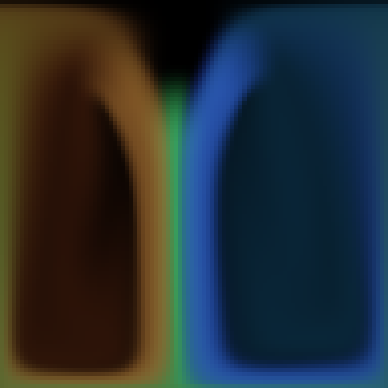

# C ABI calls with joker.ffi

`joker.ffi` loads native libraries and calls fixed C signatures without cgo. It is experimental, opt-in and intended for trusted scripts. The default build exposes documentation and unavailable errors, without linking the native-call backend.

```sh
CGO_ENABLED=0 make ffi-cli
.cache/tmp/joker-ffi doc joker.ffi
```

Supported build targets are Linux, macOS and Windows on amd64/arm64. Linux execution is tested; other targets require native library qualification. The backend is pinned to `github.com/ebitengine/purego v0.11.1`. On Linux the FFI-enabled executable depends on the system loader/libc even with `CGO_ENABLED=0`; the normal executable retains its static deployment model.

## Fixed signatures

```clojure
(require '[joker.ffi :as ffi])
(def lib (ffi/open "/absolute/path/to/libexample.so"))
(def add (ffi/bind lib "example_add" [:i32 :i32] :i32))
(add 20 22)
;; => 42
```

Use `.so`, `.dylib` or `.dll` paths appropriate to the host. Windows uses restricted DLL search flags; Unix uses `RTLD_NOW|RTLD_LOCAL`. Libraries stay loaded for process lifetime; there is no unload API. Bound functions have distinct object identity and keep their library alive.

| Type | Conversion |
| --- | --- |
| `:i8`, `:i16`, `:i32`, `:i64` | Checked signed Joker Int |
| `:u8`, `:u16`, `:u32`, `:u64` | Checked Int or BigInt; wide results become BigInt |
| `:intptr`, `:uintptr`, `:size-t` | Pointer-width integer; unsigned inputs checked |
| `:f32`, `:f64` | Double input/output, with float overflow check |
| `:cstring` | Call-scoped UTF-8 input, rejects embedded NUL; copied NUL-terminated output |
| `:pointer` | Opaque pointer, byte buffer or nil input; opaque pointer/nil output |
| `:void` | Return only; yields nil |

C `long` and Win32 `BOOL` are not aliases for Go `int` or C `_Bool`; choose the library's exact width. There is no automatic header parsing or signature discovery. Struct-by-value calls, callbacks and C variadics are not exposed. The earlier curl investigation required native libffi for its true variadic `easy_setopt`; that dependency is not included here.

## Buffers

```clojure
(def event (ffi/buffer 56))
;; Pass event as :pointer to a synchronous function.
(ffi/u32 event 0) ;; checked little-endian uint32 read
```

Buffers contain zeroed bytes and are bounded to 64 MiB. Native functions may access them only during the call and must not retain the address. The caller must ensure adequate size/alignment for the C API and coordinate concurrent access; native writes bypass Go's race detector. `u32` checks byte bounds. Hosts can use `Buffer.Bytes` for bounded simulation/image work.

Returned pointers retain input pointer/buffer owners conservatively, including aliases, and compare by native address. They are borrowed; release native-owned memory using the matching library API, and never mix allocators. `:cstring` output is suitable only when the C contract guarantees a live, NUL-terminated string; it does not release C-owned strings. There is no general native allocator or retained-pointer API in this version.

## Threads and authority

FFI executes arbitrary native code, including library constructors, with full process authority. Bad pointers/signatures can corrupt memory or terminate Joker; language exception handling is not a sandbox. Do not enable FFI for untrusted notebooks. The build tag and explicit package import enable it for a trusted process; there is no per-library sandbox policy.

The tagged CLI locks its startup goroutine to the process main OS thread. Embedded hosts must choose their own owner-thread executor. SDL/AppKit video APIs on macOS require the process main thread, not any locked worker. Native calls cannot generally be cancelled by a script timeout. Thread-local errno/GetLastError capture is not provided; use API return codes and explicit error functions with the required thread discipline.

## SDL fluid sample

The [SDL fluid example](../examples/graphics/sdl-fluid/README.md) uses this namespace for every SDL call. Its companion Go host supplies a reusable stable-fluid solver and buffers; it has no compiled SDL function binding. It does not add simulation operations to `joker.ffi`.



```sh
make sdl-fluid-screenshot
# Interactive (provide your platform's absolute SDL2 library path):
.cache/tmp/sdl-fluid -frames 0 -library /absolute/path/to/SDL2
```

## Validation and profiling

The [validation record](FFI_VALIDATION_2026-10-05.md) lists executed targets, profiles, review fixes and limitations.

`make ffi-check` runs profiled FFI and solver tests. C is used only to compile a known test fixture; Go callers build with `CGO_ENABLED=0`. Tests cover arity/type errors, overflow, full uint64, NULL, buffers, missing symbols, foreign identity/map keys and a native counter before arithmetic overflow. The counter regression covers the interpreter path; it is not a complete tier-equivalence proof.

`make sdl-fluid-screenshot` profiles a finite run and captures actual `SDL_RenderReadPixels` output as a PNG. The screenshot is not a byte/hash acceptance oracle: image/solver tests check finite fields, output ranges and documented numeric tolerances. Go heap profiles do not account for SDL/native-library allocations.
