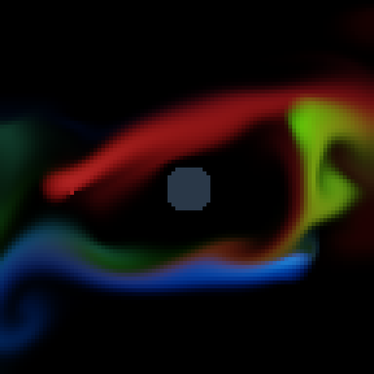

## SDL fluid simulation with compiled WASM

This example runs a 96x96 RGB dye simulation using Joker functions compiled to WASM by `jit/compile-wasm`. With `--wasm-engine compiler`, wazero compiles the WASM kernels to native machine code. Joker calls SDL2 through `joker.ffi` to display the result in a 768x768 window.



The screenshot is an SDL framebuffer readback after 300 fixed steps of 1/60 second, captured on Linux amd64 with the compiler engine and an Xvfb display.

## Build and run

Install the SDL2 runtime library, then run these commands from the repository root. The Go host builds with `CGO_ENABLED=0`; no C compiler is needed.

```sh
source scripts/project-env.sh
make sdl-wasm-fluid
"$PROJECT_TMP_ROOT/build/sdl-wasm-fluid" --wasm-engine compiler -frames 0
```

Close the window to stop. Use `-library /absolute/path/to/SDL2` if SDL2 is not at the Linux amd64 default, `/usr/lib/x86_64-linux-gnu/libSDL2-2.0.so.0`. The library architecture must match the process. Native macOS and Windows execution has not been qualified for this example.

For a finite, headless render that updates the screenshot:

```sh
make sdl-wasm-fluid-screenshot
```

The screenshot target captures CPU and allocation profiles. Review them and run `make profile-dispose PROFILE_RUN=/absolute/run/path PROFILE_NOTE="concise findings"` immediately after use.

`--wasm-engine interpreter` executes the same WASM kernels through wazero's interpreter for comparison. Explicit compiler selection does not silently fall back.

## Calculation and rendering

`kernels.joke` defines forcing, vorticity confinement, semi-Lagrangian advection, 18-pass pressure projection, obstacle handling and colour conversion. These calculations run in import-free WASM with checked f64 buffers and nested loops. There is no external C solver or Go simulation fallback.

`fluid.joke` handles SDL window, texture and event calls through FFI. `main.go` owns the buffers, copies the calculated pixels into the SDL upload buffer and writes the framebuffer readback as PNG. FFI calls stay outside the compiled kernels; the script runner and SDL orchestration run in Joker.

Buffers are copied into and out of WASM memory once per kernel call. Invalid indices trap, and writes completed before a trap are copied back without replaying the kernel. This is a visual simulation, not a validated computational-fluid-dynamics model.

See [WASM execution](../../../docs/WASM_EXECUTION.md) and [FFI contracts](../../../docs/FFI.md).
